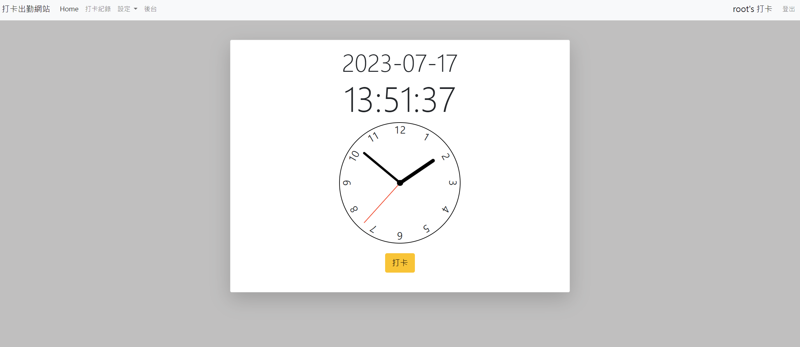

# Simple CheckIn Web

這是一個簡單的打卡網站，可以記錄當前打卡時間和出缺勤狀況。

## CheckIn-Web URL

DEMO: http://checkin.ap-northeast-1.elasticbeanstalk.com/




## 功能

- 使用者可以註冊/登入帳號
- 使用者可以在首頁打卡(每天的第一次打卡為上班時間，第二次打卡為下班時間，後續的重複打卡為更新下班時間，非工作日不允許打卡，參考 112 年中華民國政府行政機關辦公日曆表。)
- 使用者可以修改自己的帳戶資料(name、password)
- 使用者可以查看自己的打卡紀錄
- 後台管理員可以登入後台
- 後台管理員可以檢視所有使用者的出勤狀況、值勤時間
- 後台管理員可以將使用者的缺勤狀態改為出勤

## 測試種子資料

- 可使用下方帳號分別登入前台及後台

### User account

```
{
  "account": "user1",
  "password": "acuser"
}
```

### Admin account

```
{
  "account": "root",
  "password": "acuser"
}
```

## 本地端專案建置

1. 使用終端機將專案 clone 至本地

2. 進入專案資料夾(check-in-web)

3. 安裝相關套件(npm install)

4. 建立.env 並參考.env.example，放入環境變數

5. 開啟./config/config.json 檔案，修改成本地資料庫使用的帳號密碼

```
{
  "development": {
    "username": "<your_mysql_workbench_name>",
    "password": "<your_mysql_workbench_password>",
    "database": "checkin",
    "host": "127.0.0.1",
    "dialect": "mysql"
  },
}
```

6. 使用 MySQL Workbench 建立資料庫

```
drop database if exists checkin;
create database checkin;
```

7. 建立資料庫模型

```
npx sequelize db:migrate
```

8. 建立種子資料

```
npx sequelize db:seed:all
```

9. 啟動伺服器

```
npm run dev
```

10. 在終端機看到以下字串代表伺服器建立成功

```
App is running on server!
```

## Tools

- bcryptjs@2.4.3
- connect-flash@0.1.1
- dotenv@16.3.1
- express@4.18.2
- express-handlebars@7.0.7
- express-session@1.17.3
- method-override@3.0.0
- moment@2.29.4
- mysql2@3.4.2
- passport@0.6.0
- passport-local@1.0.0
- sequelize@6.32.1
- sequelize-cli@6.6.1
